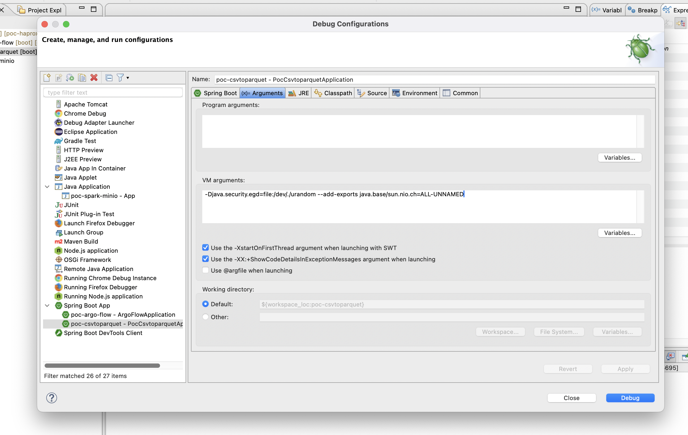

# Description

Convert any csv file to parquet file format in java using:

- JDK 17
- SpringBoot 3.3.4
- Spark version 3.4.0 with scala 2.13.
- Jakarta servlet 4.0.3
- Jersey version 2.36

You must to add this attribute to your VM

```
--add-exports java.base/sun.nio.ch=ALL-UNNAMED
```



## Test your API

To convert a csv filr to parquet file using spark we can execute this endpoint and see the results:

```
curl -F "file=@/home/miguel/temp/datasets/sample/datamatrix.csv" http://localhost:8888/convert
```
